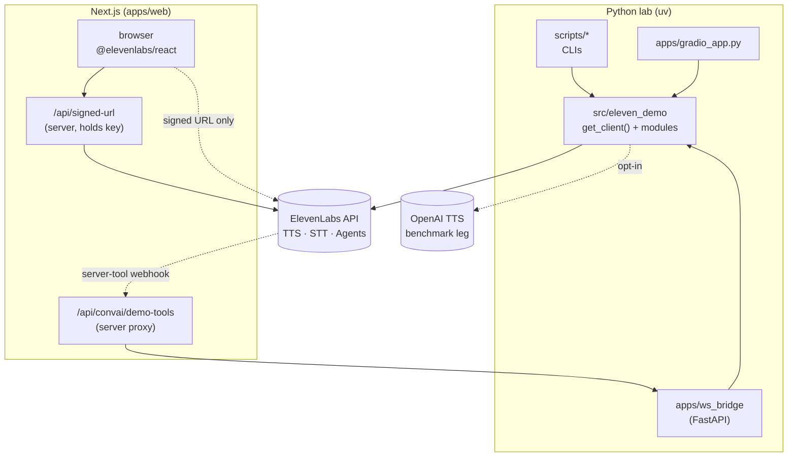

# ElevenLabs agents and API exploration

Hands-on **Python** lab for **[ElevenAgents](https://elevenlabs.io/docs/eleven-agents/overview)** and **[ElevenAPI](https://elevenlabs.io/docs/api-reference/introduction)**: Brazilian-market voice scenarios, latency checks, and thin browser surfaces. Use it to reason about tools, KB/RAG, retention posture, and how SDK pieces fit together — not as a product or compliance proof.

Step-by-step path: [end-to-end walkthrough](docs/walkthrough.md).

---

## What this explores

- **Three agent verticals** — telecom SAC, digital banking (ZRM-minded), healthcare triage + KB/RAG.
- **ElevenAPI** — TTS (sync, HTTP stream, WebSocket), batch and realtime STT, Voice Library helpers, Voice Isolator demo, optional **OpenAI TTS** leg for vendor comparison when `OPENAI_API_KEY` is set.
- **Surfaces** — **Gradio** (full demo), optional **Next.js** (`elevenlabs/ui`, Telecom-only reference), optional **FastAPI** WebSocket TTS bridge under `apps/ws_bridge/` for local experiments.
- **Quality** — typed settings, Pydantic tool schemas, REST retries, pytest (+ VCR integration), ruff, pre-commit (e.g. secret scanning).

---

## Quick start

**Prerequisites:** Python **3.13+** and [`uv`](https://docs.astral.sh/uv/).

```bash
git clone https://github.com/adriannoes/elevenlabs-agents-api-playground.git
cd elevenlabs-agents-api-playground
cp .env.example .env
uv sync --extra dev
uv run python scripts/verify_api_keys.py
```

Set `ELEVENLABS_API_KEY` in `.env`. For **ElevenAgents provisioning**, set at least one of:

- **`DEFAULT_AGENT_VOICE_ID`** (recommended) — English or multilingual Voice Library id for the ElevenAgents tabs.
- **`DEFAULT_EN_VOICE_ID`** — English Voice Library id used for Convai when `DEFAULT_AGENT_VOICE_ID` is unset (preferred over PT for English demos).
- **`DEFAULT_PT_VOICE_ID`** — used by the TTS playground, WebSocket bridge, and ElevenLabs vendor benchmark leg; last fallback for agent voice if no agent/EN id is set.

List PT-BR-friendly voices:

```bash
uv run python scripts/voices_pt_br.py
```

If nothing is labelled PT-BR, pick any voice id from the sample output and set `DEFAULT_PT_VOICE_ID` manually. Vendor benchmarking also needs `OPENAI_API_KEY` if you want the OpenAI leg.

---

## Run the demo (Gradio)

**One command:** verify the key, provision all three agents, and write `DEMO_AGENT_ID_*` into `.env` (requires `ELEVENLABS_API_KEY` plus any one of `DEFAULT_AGENT_VOICE_ID`, `DEFAULT_EN_VOICE_ID`, or `DEFAULT_PT_VOICE_ID`):

```bash
uv run python scripts/demo_prepare.py
```

**Manual path** (same outcome; paste printed ids yourself):

```bash
uv run python scripts/agent_create.py telecom
uv run python scripts/agent_create.py banking
uv run python scripts/agent_create.py healthcare
```

```bash
uv run python apps/gradio_app.py
```

Open the URL Gradio prints. Tabs: **TTS Playground**, **Telecom**, **Banking**, **Healthcare**, **Latency**, **Vendor benchmark** (ElevenLabs vs OpenAI when both keys and `DEFAULT_PT_VOICE_ID` are set for the ElevenLabs leg).

Provisioning detail: [`product/guides/demo-agent-setup.md`](product/guides/demo-agent-setup.md).

---

## Gradio vs `apps/web`

| Surface | Role |
| --- | --- |
| `uv run python apps/gradio_app.py` | Full demo: all three agents, TTS playground, latency, vendor benchmark. Reads `DEMO_AGENT_ID_*` from the **repo** `.env`. |
| `pnpm --dir apps/web dev` | Small **Next.js** reference: [`elevenlabs/ui`](https://github.com/elevenlabs/ui) + signed URL so the browser never sees `ELEVENLABS_API_KEY`. **Telecom only** — `DEMO_AGENT_ID_TELECOM` in `apps/web/.env.local`. |

Next.js intentionally covers **Telecom only**: it demonstrates the React registry and signed URLs without re-implementing Banking and Healthcare. Reuse the Telecom `agent_id` in `apps/web/.env.local`. Setup: [`apps/web/README.md`](apps/web/README.md).

```bash
cd apps/web
cp .env.example .env.local
pnpm install
pnpm dev
```

Requires Node **20+** and **pnpm**.

---

## CLI smoke

```bash
uv run python scripts/tts_demo.py "Hello — ElevenLabs real TTS smoke test." --out artifacts/real-tts-smoke.mp3
uv run python scripts/stt_demo.py data/samples/hello-pt-br.mp3
uv run python scripts/tts_stream_ttfb.py --n 10 --model flash
uv run python scripts/voice_isolator_demo.py data/samples/hello-pt-br.mp3 --out artifacts/clean.mp3
uv run python scripts/tts_vendor_benchmark.py --n 1 --out artifacts/benchmarks/tts-vendor-smoke.json
```

These hit the live API and may consume credits. Do not commit secrets or unredacted PII under `artifacts/`.

---

## Scenario write-ups

- [Telecom — customer care](docs/scenarios/telecom.md)
- [Banking — digital banking](docs/scenarios/banking.md)
- [Healthcare — triage](docs/scenarios/healthcare.md)

---

## Repository layout

```text
src/eleven_demo     Library (client, config, TTS, STT, voices, agents, scenarios, benchmarks, metrics)
apps/gradio_app.py  Primary UI
apps/web/           Optional Next.js + elevenlabs/ui (Telecom)
apps/ws_bridge/     Optional FastAPI WebSocket TTS bridge (local)
scripts/            CLIs (provision, simulate, demos, benchmark, evidence helper)
tests/              Unit + VCR integration tests
docs/               Walkthrough, scenarios, benchmarks methodology, technical report, design notes
data/kb/healthcare/  Fictional KB seeds
data/samples/        Sample audio for STT
engineering/        Delivery record, ADRs
product/guides/     Operator-facing agent setup
.cursor/skills/     ElevenLabs-focused Cursor skills (optional)
```

---

## Architecture

The library `src/eleven_demo` is the single ElevenLabs integration point — every Python surface (CLIs, Gradio, the WebSocket bridge) imports it, and SDK access flows through `get_client()` (one factory with retries on 429/5xx, no ad-hoc constructors). The Node side mirrors that boundary on its own toolchain: `ELEVENLABS_API_KEY` lives only in `apps/web` server code; the browser receives a short-lived **signed URL** and never sees the key.



Two flows worth calling out:

- **Browser → ElevenLabs** (Next.js): the page calls `/api/signed-url` (server-side, holds the key), gets back a short-lived URL, and opens the conversation directly with ElevenLabs Agents via `@elevenlabs/react`. No key in the client bundle.
- **ElevenLabs → tool webhook** (server tools): when an agent invokes a server tool, Convai POSTs to the public URL configured on the agent. The tunnel routes to `apps/web/api/convai/demo-tools`, which proxies to `apps/ws_bridge`, which dispatches the deterministic mock via `eleven_demo.agents.tool_webhook`. (Direct tunnel to `ws_bridge` works too — see [`apps/web/README.md`](apps/web/README.md).)

`apps/web/` has its own Node toolchain (`pnpm`, `pnpm-lock.yaml`) and sits **outside** Python pre-commit, `uv.lock`, and Python coverage gates. Rationale: [`engineering/architecture/tech-stack-decisions.md`](engineering/architecture/tech-stack-decisions.md).

---

## Further reading

- [Delivery record](engineering/tasks/tasks-prd-elevenlabs-vertical-exploration.md)
- [Walkthrough](docs/walkthrough.md)
- [TTS vendor methodology](docs/benchmarks/tts-vendor-comparison.md)
- [Technical exploration report](docs/reports/technical-exploration-report.md)
- [Visual system](docs/design/visual-system.md)
- [PRD](product/prd/prd-elevenlabs-vertical-exploration.md)

---

## Tests and hygiene

```bash
uv run pytest -n auto -m "not integration"
uv run pytest -m integration
uv run ruff check .
uv run ruff format --check .
uv run pre-commit run --all-files
```

Integration tests use VCR under `tests/integration/**/cassettes/`: **replay** avoids live calls when the YAML exists; **recording** needs real keys and costs credits. To record scenario + vendor cassettes: `uv run python scripts/record_integration_cassettes.py --provision` (see [`tests/integration/README.md`](tests/integration/README.md)). Never log API keys, `Authorization`, or raw PII.
