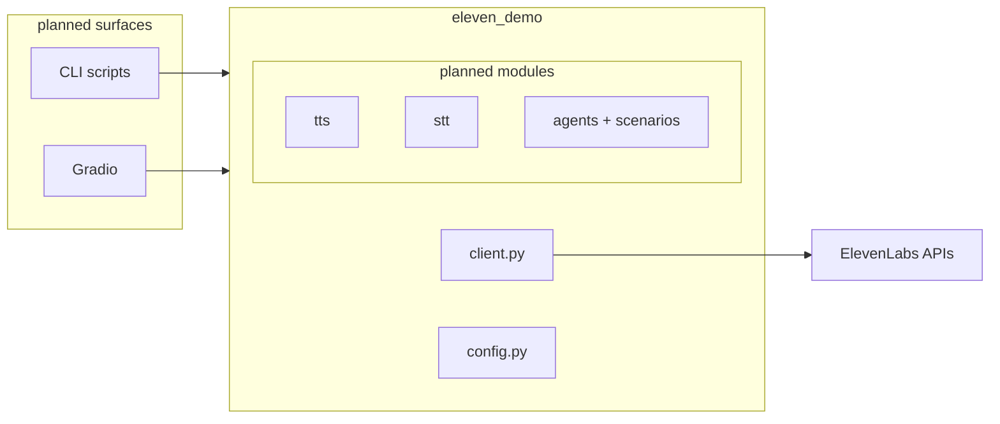

# ElevenLabs Demo for Learning

Hands-on Python lab for exploring **[ElevenAgents](https://elevenlabs.io/docs/eleven-agents/overview)** and **[ElevenAPI](https://elevenlabs.io/docs/api-reference/introduction)** through Brazilian-market voice AI use cases.

The goal is to build practical product intuition: how agents, speech APIs, tool calling, latency, knowledge bases, and compliance fit together in real implementation work. This is not a shipped product; it is a focused learning and demo environment.

---

## What this explores

- **Voice agents in realistic verticals**: telecom support, digital banking CX, and healthcare triage.
- **Core ElevenLabs primitives**: TTS, STT, voice selection, agents, tools, knowledge base / RAG, simulation, and post-call analysis.
- **Latency and vendor evaluation**: TTFB-focused benchmarks for ElevenLabs Flash models and a planned OpenAI TTS comparison.
- **Engineering discipline**: typed config, retry behavior, pytest, VCR-backed integration tests, security checks, and generated evidence reports.

The full roadmap lives in [`engineering/tasks/tasks-prd-elevenlabs-vertical-exploration.md`](engineering/tasks/tasks-prd-elevenlabs-vertical-exploration.md), so current implementation and planned work stay clearly separated.

---

## Implemented vs roadmap

**Done today**

- **`eleven_demo.config`**: `pydantic-settings`, `SecretStr` API key, fail-fast validation.
- **`eleven_demo.client`**: single `get_client()` → shared `ElevenLabs` instance, **REST retries** on `429` / `5xx` with exponential backoff, `timeout=30s`.
- **Tests**: unit tests for env loading and retry behavior; **`tests/conftest.py`** skips integration tests without a key when no VCR cassette exists; `MagicMock(spec=ElevenLabs)` fixture.
- **`scripts/verify_api_keys.py`**: minimal HTTPS checks for ElevenLabs + optional OpenAI keys (prints OK/SKIP/FAIL only).

**Next** (same repo, task-driven): TTS/STT wrappers, voice helpers, agent provisioning + simulation, Gradio playground, vendor benchmark, and technical exploration report — see the engineering task list linked above.

---

## Use cases

These fictional scenarios are design targets for agents and tooling. Each one stresses a different combination of ElevenLabs primitives: tools, latency sensitivity, KB/RAG, compliance posture, and escalation.

### 1. Telecom — “ACME Telecom” (PT-BR SAC)

**Context** — Conversational SAC for a Brazilian B2C carrier (think major retail telcos): high **AHT**, **R$ 4–7** cost per call, legacy IVR dragging **NPS**.

**What it stresses on the platform** — A **PT-BR** agent authenticates (e.g. by **CPF**), retrieves plan / quota / balance through **server tools**, and escalates to a human when policy requires it.

**Concrete mechanisms** — Mock tools such as `lookup_telecom_account(cpf)` and `transfer_to_human(reason)` for browser-friendly demos; in production, carriers often wire [**transfer_to_number**](https://elevenlabs.io/docs/eleven-agents/customization/tools/system-tools/transfer-to-number) for real PSTN/SIP — **out of scope here**, but called out so the demo stays honest.

**Reader takeaway** — Shows how **server tools + multilingual voice + escalation** map to measurable ops outcomes (deflection, AHT, cost per thousand calls).

### 2. Banking — “Onyx Pay” (Brazilian digital bank)

**Context** — Very high inbound volume: balances, statements, card replacement, temporary blocks, fraud suspicion — expensive humans, strict regulation.

**What it stresses on the platform** — Authenticate with **CPF + verification signal** (e.g. last transaction amount), return a **balance summary**, execute **high-trust actions** (temporary card block, replacement request), route fraud cases to a human.

**Concrete mechanisms** — Tools such as `lookup_account_summary(cpf)`, `request_card_block(...)`, `request_card_replacement(...)`, `transfer_to_human(reason)` — framed against **BACEN / LGPD / PCI-DSS** expectations and **Zero Retention Mode** where PII matters.

**Reader takeaway** — Surfaces **trust boundaries**, **tool schemas**, and **compliance-aware** agent design — not “chat about balance” in the abstract.

### 3. Healthcare — “Vita Saúde” (clinic / health plan)

**Context** — Triage delays, **no-shows**, overloaded call centers — voice as a front door before a clinician.

**What it stresses on the platform** — **PT-BR triage** by symptoms; **RAG** over a **small fictional KB** (protocols, specialties, LGPD-style notice); suggest specialty; **book** an appointment via tools.

**Concrete mechanisms** — `book_medical_appointment(...)`, `transfer_to_human(reason)`; KB seeded with **non-real** documents so RAG stays demonstrable without leaking PHI into the narrative.

**Reader takeaway** — Ties together **Knowledge Base**, **tools**, and **HIPAA-equivalent posture** (e.g. **ZRM**, redaction mindset) — the same pillars enterprise healthcare buyers ask about.

---

## Architecture

Library code owns **all** ElevenLabs access; demos import **`eleven_demo`** only — no SDK calls scattered in UI shells.



Today only **`client.py`**, **`config.py`**, and **tests** are fully implemented; other packages are placeholders until the roadmap lands.

---

## Tech stack (headline)

| Layer | Choice | Rationale |
|---|---|---|
| Runtime | Python 3.13 | First-class ElevenLabs SDK support. |
| Tooling | [uv](https://docs.astral.sh/uv/) + lockfile | Fast installs, reproducible CI. |
| Config / IO | Pydantic v2 + pydantic-settings | Typed env and tool boundaries. |
| Quality | [ruff](https://docs.astral.sh/ruff/), pytest (+ VCR for integration later) | One formatter/linter; deterministic tests where it matters. |
| Pre-commit | ruff, gitleaks, detect-private-key | Catch secrets before push. |

More detail: [`engineering/architecture/tech-stack-decisions.md`](engineering/architecture/tech-stack-decisions.md).

---

## Quick start

```bash
git clone https://github.com/adriannoes/eleven-labs-demo.git
cd eleven-labs-demo
cp .env.example .env   # at minimum ELEVENLABS_API_KEY

uv sync --extra dev
uv run python scripts/verify_api_keys.py
uv run pytest tests/unit/ -v
# optional: uv run pre-commit install
```

---

## Tests

```bash
uv run pytest -n auto -m "not integration"   # fast unit loop
uv run pytest -m integration                  # when cassettes exist
```

Selective **TDD** on config, retries, and contracts; thin API wrappers get mocks + VCR rather than brittle LLM assertions.

---

## License and ethics

MIT.

No voice cloning of real people — only Voice Library or synthetic voices, per ElevenLabs ToS expectations.
