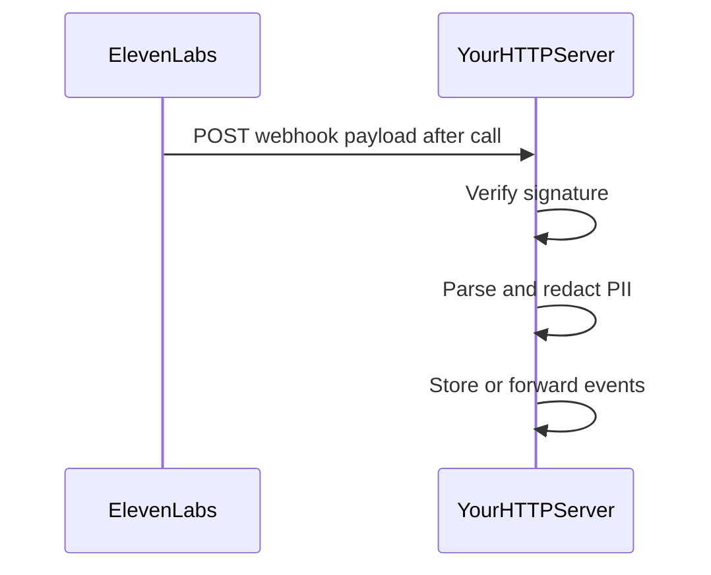

# Post-call webhooks (reference pattern)

This document describes how **post-call webhooks** fit into a real integration. This **learning lab** intentionally does **not** host a public HTTP receiver for them, to keep scope small and avoid running TLS, signature verification, and PII handling as a always-on service here. Local exploration uses the Conversations API via [`scripts/conversations_list.py`](../../scripts/conversations_list.py); see also [Tech Stack Decisions](../../engineering/architecture/tech-stack-decisions.md).

## End-to-end flow

Official overview: [Post-call webhooks](https://elevenlabs.io/docs/eleven-agents/workflows/post-call-webhooks).

## Checklist for a real receiver

1. **HTTPS** — Expose only TLS endpoints in production; do not rely on plain HTTP for customer data.
2. **Verify the webhook signature** — Reject payloads that fail cryptographic verification using the secret or mechanism described in the current ElevenLabs docs (algorithm and headers change over time; pin behavior to the doc version you deploy against).
3. **Idempotency** — The same logical event may be retried; use a stable event or conversation id to deduplicate.
4. **PII and retention** — Persist the minimum necessary fields. Redact or avoid storing raw transcripts when policy requires it (e.g. zero-retention agent configurations).
5. **Fast response** — Return success quickly and offload heavy work to a queue or worker if needed.
6. **Logging** — Log metadata (conversation id, status) without logging secrets or full transcript bodies in shared logs.

## What this repository does instead

- [`scripts/conversations_list.py`](../../scripts/conversations_list.py) lists or fetches conversations and **redacts** common Brazilian PII patterns before printing.
- No webhook URL is required for that path, so nothing needs to be exposed on the public internet for a quick lab session.

If you outgrow the lab, implement a **separate** authenticated service for webhooks rather than extending this repo into a production ingress.
